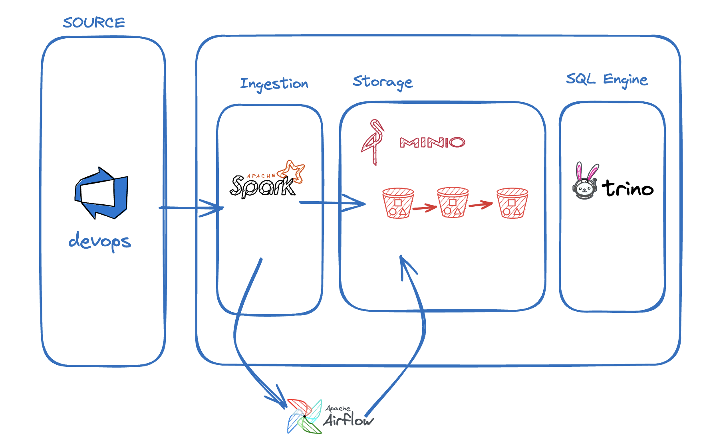

# Alternative Solution in Spark

The alternative solution in Spark was developed using Apache Spark, Apache Airflow, and MinIO in a development environment. This solution orchestrates the processing of WorkItem data, performing ETL (Extract, Transform, Load) through three stages: raw, standardized, and consume.

## Project Structure

The project structure is organized as follows:

mmd/
├── raw-etl-workitem.py
├── stan-etl-workitem.py
└── cons-etl-workitem.py
dags/
└── workitem_dag.py
docker-compose.yml

