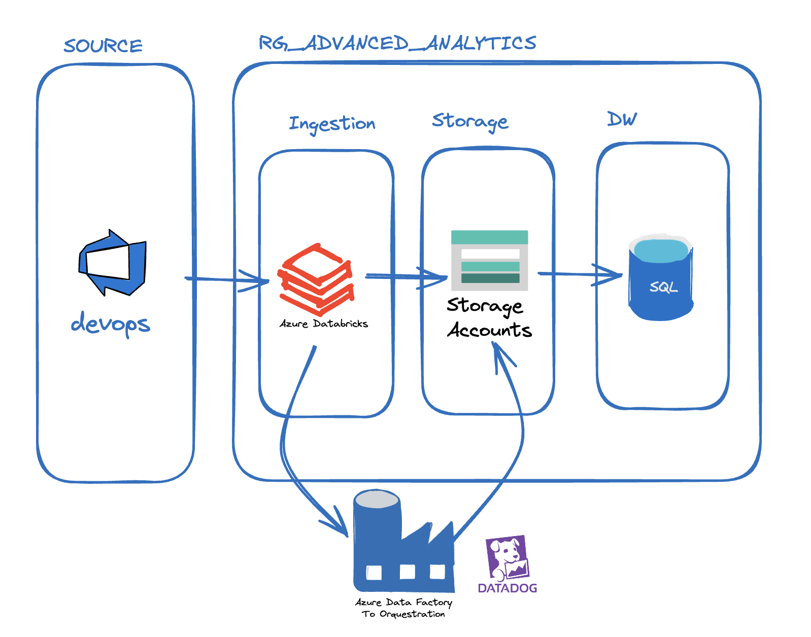
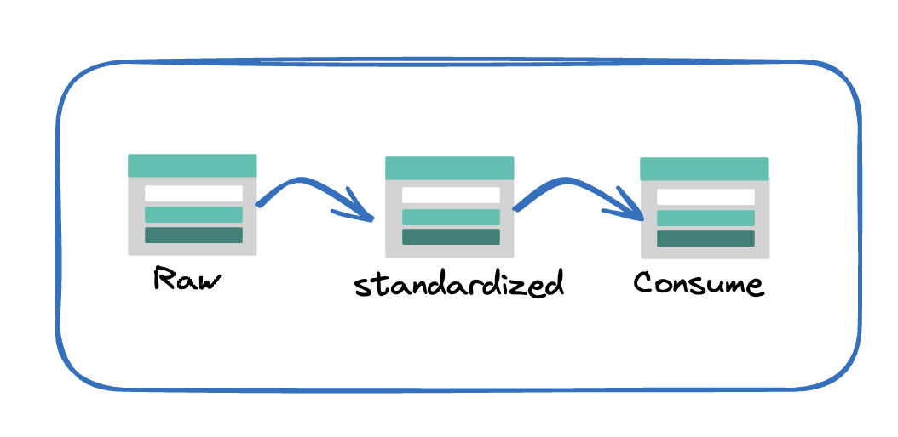
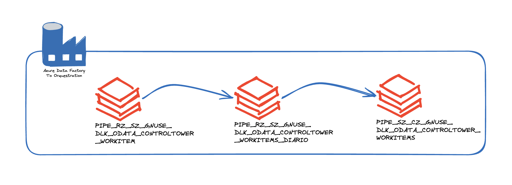
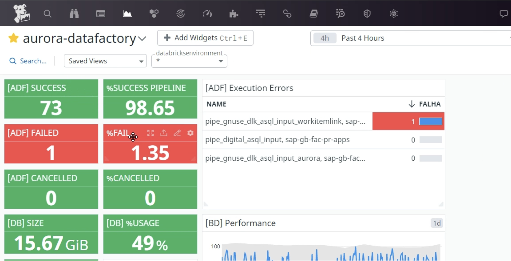

# Introduction

The client needed to ingest data from Azure DevOps for strategic decision-making and personalized monitoring of various ongoing projects in the company. Initially, the data was extracted via CSV from Azure DevOps and input directly into PowerBI. Due to the scale of the projects, this became a time-consuming process requiring 4 people and taking 2 to 3 days to consolidate and make the information available. The main requirement was for the solution to be developed on Azure, allowing for daily processing and data updates in the corporate data warehouse.

The proposed architecture for this project is shown below:

First, I created a simplified architecture for reading data from the API using Databricks for ingestion, Data Factory for orchestration, and Datadog for environment monitoring.

For the data lake, I used the following strategy:

- **Raw Layer**: In this layer, raw data is stored without alterations, allowing for source data tracking and maintaining data integrity. The original format of data is JSON.

- **Standardized Layer**: Data undergoes a transformation and cleaning process in this layer. It is standardized and typed to ensure high quality and ease of use. The data format used is Parquet.

- **Consume Layer**: Ready-to-use data is stored here, ready for querying and analysis, saving processing time whenever someone accesses the data. The data format used is Parquet.

I used Parquet to enable the lifecycle manager feature in the data lake, as the data would have a lifecycle of 90 days. After this period, it could be archived to reduce operational costs in the data lake.

### 1. Data Collection

Highly effective Python scripts are utilized to extract detailed data from Azure DevOps APIs, including information from the following areas:
- Work Items
- Work Item History
- Board Locations
- Iterations
- Processes
- Projects
- Teams
- Users
- Work Item Links
- Work Item Revisions

For this case, I will present only WorkItems, as the entire collection follows the same sequence.

### 1. Project Organization

The project is organized as follows:

**Access:**
- Folder containing the files:
  - `mount_ADLS.py`: This script mounts an Azure Data Lake Storage Gen2 file system in Databricks using OAuth for authentication. Credentials are obtained from a Key Vault, allowing access to the data at the specified path and mounting it at `/mnt` for easy access.
  - `Connections_Variable`: This script establishes connections with a SQL Server database and the Azure DevOps API, configuring variables and functions to fetch and process DevOps data, as well as preparing paths in the Data Lake and defining auxiliary functions for updating logs and controlling data loading, although some functions are not currently in use.

**DevOps:**
- raw
- standardized
- consume

The DevOps repository contains the entire project that will be executed and orchestrated in Data Factory.

### 2. DataDog  

### 3. Conclusion

At the end of the project, the following benefits were observed:

- Reduction of data processing time from the API by up to 95%.
- Data writing of tables using merge instead of drop table, ensuring that the table is always populated.
- The POWERBI load process will be related only to database loading and will no longer be triggered by POWERBI itself.
- Separation of subjects to allow different execution times for each subject.

For more information, see the complete project at: [Project Repository](https://github.com/diegomendesbrasil/azure-dbricks-data-devops.git)
